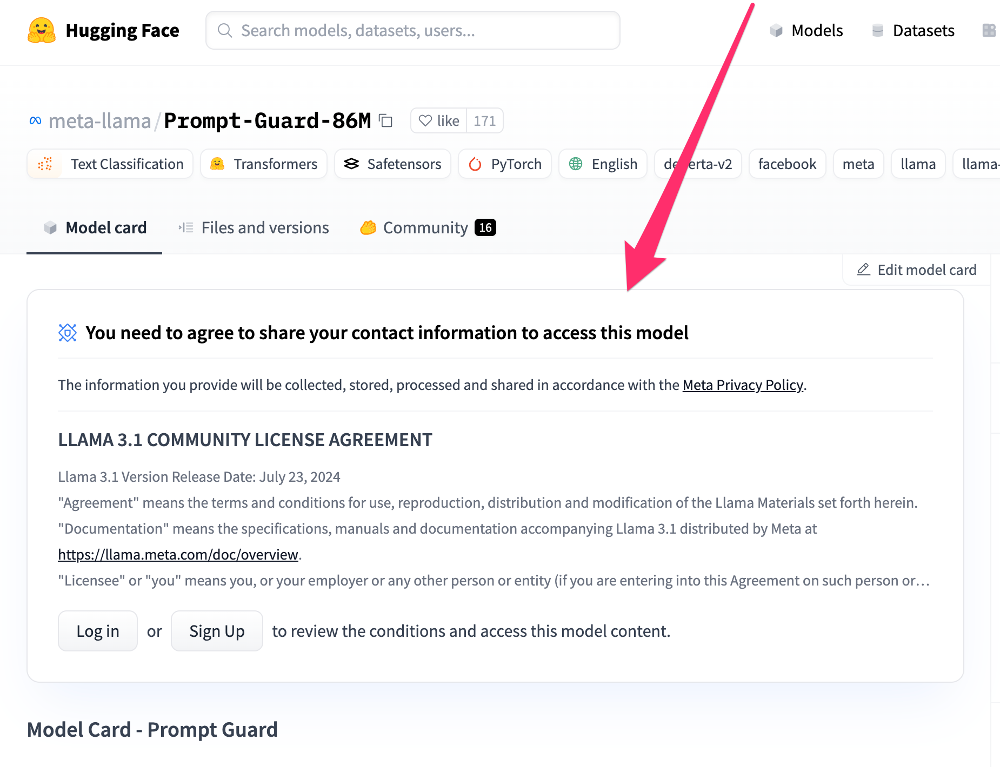

# Security Chatbot


A chatbot implementation that demonstrates security defenses for generative AI.
Created for the talk: [Hacking and securing your GenAI applications](https://docs.google.com/presentation/d/18FUV5O1mfQEeSth6F8JlLV7fsSmDTGnG1OCgTOg8urU/edit#slide=id.p1)

## Table of Contents
- [1. Installation](#1-installation)
- [2. LLM Providers](#2-llm-providers)
- [3. Running the Chatbot](#3-running-the-chatbot)
- [4. Testing](#4-testing)

## 1. Installation

```shell
pyenv install 3.10
poetry install
```

### 1.1 Security Features

This project integrates two Meta Llama security tools:
- **Llama PromptGuard**
- **Purple-Llama CodeShield**

> **Important**: These tools are part of the [Llama 3.1 license](https://www.llama.com/llama3_1/license/), which has restrictions on commercial use.

- You can disable security features by modifying the `LLAMA_SECURITY_FAMILY` variable in [`src/config/llm_config.py`](src/config/llm_config.py).

#### Accessing Security Models
1. Request access to models on HuggingFace (e.g., [meta-llama/Prompt-Guard-86M](https://huggingface.co/meta-llama/Prompt-Guard-86M))
 <br/><br/><br/>
    
2. Configure your `HF_TOKEN` environment variable with your [HuggingFace personal token](https://huggingface.co/docs/hub/security-tokens)

## 2. LLM Providers

The chatbot supports three LLM providers:
- Amazon Bedrock
- Groq
- OpenAI
- Anthropic

Configure your preferred provider in [`config/llm_config.py`](config/llm_config.py).

### 2.1 Provider Setup

#### 2.1.1 Amazon Bedrock
Configure AWS SSO profile:

```shell
PROFILE_NAME="data-dev" 
ACCOUNT_NUMBER="123456789123"
ROLE="power"
SSO_START_URL="https://YOUR_ORGANIZATION.awsapps.com/start"
REGION="eu-west-1"

aws configure set sso_start_url $SSO_START_URL --profile $PROFILE_NAME
aws configure set sso_region $REGION --profile $PROFILE_NAME
aws configure set sso_account_id $ACCOUNT_NUMBER --profile $PROFILE_NAME
aws configure set sso_role_name $ROLE --profile $PROFILE_NAME
aws configure set region $REGION --profile $PROFILE_NAME
aws configure set output json --profile $PROFILE_NAME
```
Conéctate usando el siguiente comando:
```text
aws sso login --profile data-dev
```

#### 2.1.2 Groq
- Create an API key at [console.groq.com/keys](https://console.groq.com/keys)
- Includes generous free tier ([Rate limits](https://console.groq.com/docs/rate-limits))

#### 2.1.3 OpenAI
- Create an API key at [platform.openai.com/settings/organization/api-keys](https://platform.openai.com/settings/organization/api-keys)
- Review [pricing](https://openai.com/api/pricing/)

#### 2.1.4 Anthropic
- Create an API key at [https://console.anthropic.com/settings/keys](hhttps://console.anthropic.com/settings/keys)
- Review [pricing](https://www.anthropic.com/pricing#anthropic-api)


## 3. Running the Chatbot

### 3.1 With Amazon Bedrock
```shell
aws sso login --profile data-dev
export AWS_DEFAULT_PROFILE=data-dev
poetry run python chatbot_webui.py
```

### 3.2 With Groq
```shell
export GROQ_API_KEY=YOUR_API_KEY
poetry run python chatbot_webui.py
```

### 3.3 With OpenAI
```shell
export OPENAI_API_KEY=YOUR_API_KEY
poetry run python chatbot_webui.py
```

### 3.4 With Anthropic
```shell
export ANTHROPIC_API_KEY=YOUR_API_KEY
poetry run python chatbot_webui.py
```

## 4. Testing

Required environment variables:
- `GROQ_API_KEY`
- `OPENAI_API_KEY`
- `AWS_DEFAULT_PROFILE`
- `ANTHROPIC_API_KEY`

Run tests:
```shell
poetry run pytest -v --cov=src --no-cov-on-fail --cov-report=term-missing tests/
```

## 5. Format and Linter (with auto-fix)
```shell
make lint-fix
```
